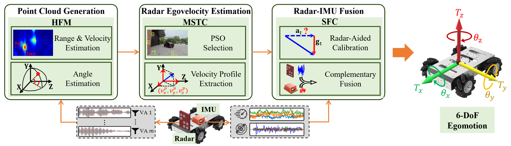
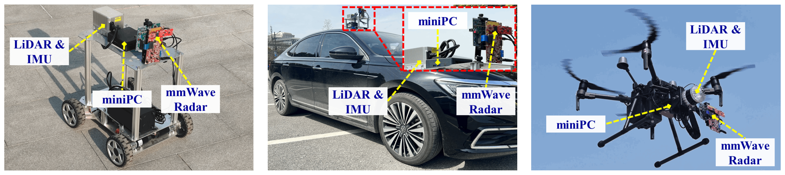
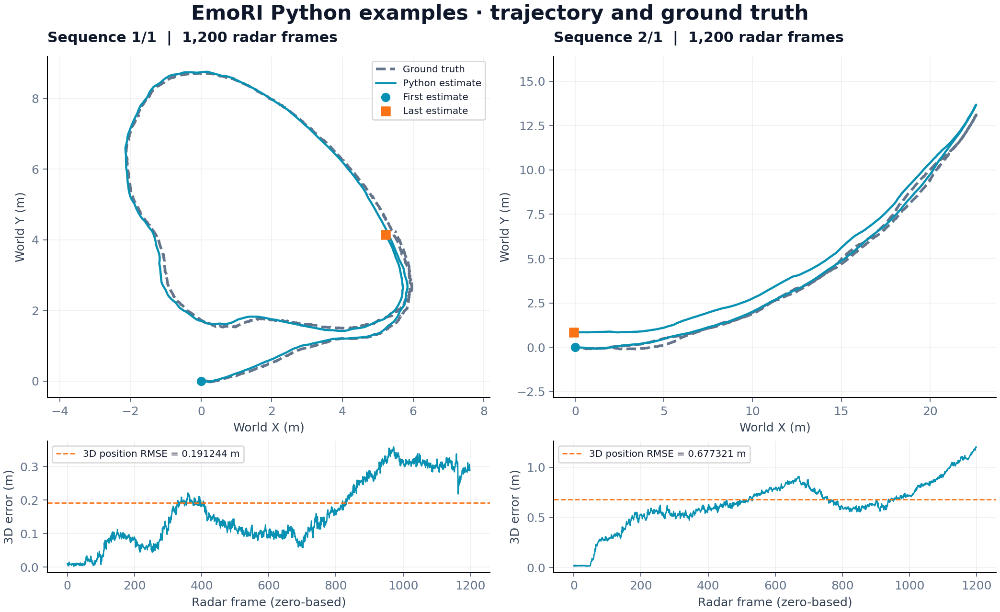
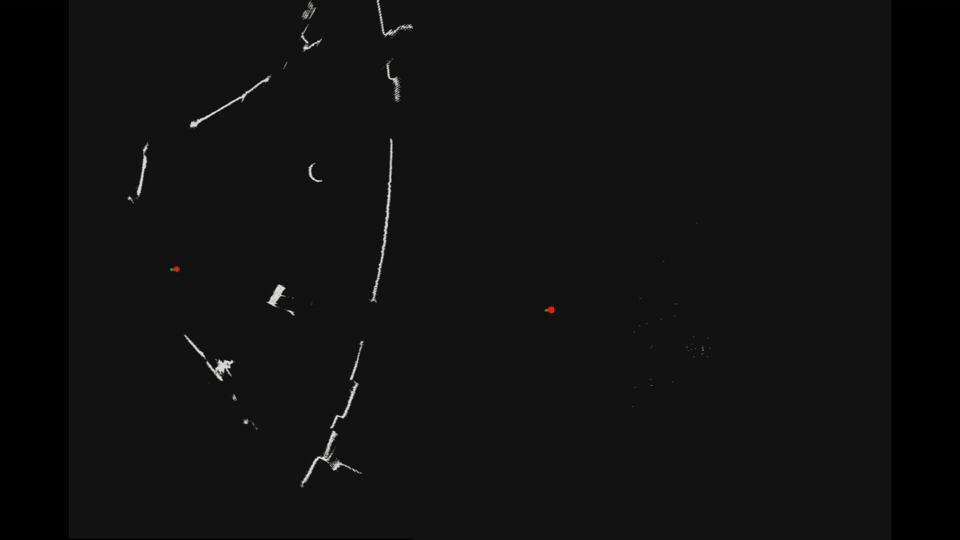

# Push the Limit of Single-Chip mmWave Radar-Based Egomotion Estimation with Moving Objects in FoV (SenSys '23)

The implementation code of the paper **[Push the Limit of Single-Chip mmWave Radar-Based Egomotion Estimation with Moving Objects in FoV](https://doi.org/10.1145/3625687.3625795)**.

The proposed approach in this paper, namely EmoRI, estimates a mobile platform's motion using a single-chip mmWave radar and an IMU in scenes containing moving objects. This offline Python implementation combines radar velocity with IMU yaw and includes two prepared recordings for immediate use. 

***<u>EmoRI is learning-free and can generalize to various environments! You can quickly reproduce and use it in only 10-30mins!</u>***

[Implementation details](docs/IMPLEMENTATION.md).

- 📄 [Paper](https://doi.org/10.1145/3625687.3625795)
- ▶️ [Project demo](https://www.cs.sjtu.edu.cn/~jinhaiming/demo/EmoRI.html)

<p align="center">
  
</p>
<p align="center"><strong>Figure 1. EmoRI Overview</strong></p>

<p align="center">
  
</p>
<p align="center"><strong>Figure 2. Mobile platforms for evaluating EmoRI.</strong></p>

## Quick Start

Use a **Python 3.13** environment (tested with 3.13.9). Download this repository, open a terminal in its root directory, and run:

```bash
python -m pip install -r requirements.txt
python EmoRI.py --backend numpy --save-plot
```

The included `(1, 1)` sample runs immediately: a window displays the estimated trajectory and ground truth, and the figure is saved to `data/slam_results/trajectory_1_1.png`. Expected result: **1,200 frames, position RMSE ≈ 0.191244 m**. No radar hardware or raw captures are needed.

On a machine without a display, append `--no-show` to save the figure without opening a window.




The egomotion estimated by EmoRI can also be used for simultaneous localization and mapping (SLAM). Stitching radar point clouds based on the estimated egomotion produces a point-cloud map. The animation below compares the SLAM results generated by a LiDAR (left) and mmWave radar (right).


  


## Input Data

### Prepared recordings

`EmoRI.py` reads four NPY files for each sequence. Two sequences, `(1, 1)` and `(2, 1)`, are included under `data/`; each contains 1,200 radar frames and 12,000 IMU samples. In the filenames below, `E` is the environment ID and `X` is the experiment ID; `N` is the number of radar frames and `P` is the total number of radar points.

| File under `data/` | Shape / dtype | Contents |
| --- | --- | --- |
| `point_cloud/pypc_E_X.npy` | `(P, 5)`, `float64` | Radar-frame `[x, y, z, radial_velocity, relative_amplitude]`; positions in **m**, velocity in **m/s** |
| `point_cloud/pypc_E_X_indices.npy` | `(N+1, 1)`, `int32` | Cumulative, zero-based point boundaries for each radar frame |
| `IMU_and_GT/0516env_aligned_imu_E_X.npy` | `(10N, 6)`, `float64` | `[ax, ay, az, gx, gy, gz]`; acceleration in **g**, angular rate in **degrees/s** |
| `IMU_and_GT/0516env_aligned_gt_E_X.npy` | `(N, 3)`, `float64` | Ground-truth world positions `[x, y, z]` in **m**, required for plotting and evaluation |

Read these files directly with `np.load(..., allow_pickle=False)`. After flattening the boundary array to `b`, radar frame `k` contains `points[b[k]:b[k+1]]`. Boundaries start at 0, end at `P`, and are nondecreasing; equal neighboring boundaries represent an empty frame. The last point-cloud column is a relative amplitude indicator, historically named `RCS`, rather than a calibrated radar cross section.

Currently, the inputs are synchronized at **10 Hz radar / 100 Hz IMU**, with one GT row per radar frame. The mounting rotation and heading correction are fixed; a new sensor setup needs to modify the codes. 

### Raw radar recordings

The source checkout includes the prepared NPY samples; download the original raw captures separately from the **[raw-data-v1 release](https://github.com/Dingrong123/EmoRI/releases/tag/raw-data-v1)**. The release provides eight original BIN files totaling **5.90 GB** (5,898,240,000 bytes). Download the four files for your chosen environment, or all eight for both environments, and place them in `data/radar_raw_data/`. See [individual downloads and validation instructions](data/radar_raw_data/README.md).

You can also generate the radar point cloud from your own recorded raw data. In this implementation, the radar point clouds are generated from raw data by `read_6843_accelerated.py`. <u>Note that such code is for TI IWR6843AoP mmWave radar. If you use other types of radars, you should modify that python file</u>. The reader expects original ADC captures named `0516env_new_E_X_Raw_K.bin` (`K = 0, 1, 2, 3` for the supplied capture layout).

| Property | Required format |
| --- | --- |
| Sample encoding | Little-endian signed `int16`, packed as `I0, I1, Q0, Q1` |
| Antennas | 3 TX / 4 RX |
| Samples | 512 complex ADC samples per chirp; 100 TDM loops per radar frame |
| Capture length | 300 frames per file; 737,280,000 bytes |

Raw captures are optional for running the prepared NPY samples. Acquisition and alignment of IMU/GT records are handled before running this code.

## Citation

If you find this code helpful , please consider to cite our paper:

```bibtex
@inproceedings{ding2023emori,
  author    = {Ding, Rong and Jin, Haiming and Ding, Jianrong and Wang, Xiaocheng
               and Fan, Guiyun and Zhu, Fengyuan and Tian, Xiaohua and Kong, Linghe},
  title     = {Push the Limit of Single-Chip {mmWave} Radar-Based Egomotion
               Estimation with Moving Objects in {FoV}},
  booktitle = {Proceedings of the 21st ACM Conference on Embedded Networked Sensor Systems},
  series    = {SenSys '23},
  year      = {2023},
  pages     = {417--430},
  publisher = {Association for Computing Machinery},
  address   = {New York, NY, USA},
  location  = {Istanbul, Turkiye},
  doi       = {10.1145/3625687.3625795},
  url       = {https://doi.org/10.1145/3625687.3625795}
}
```
